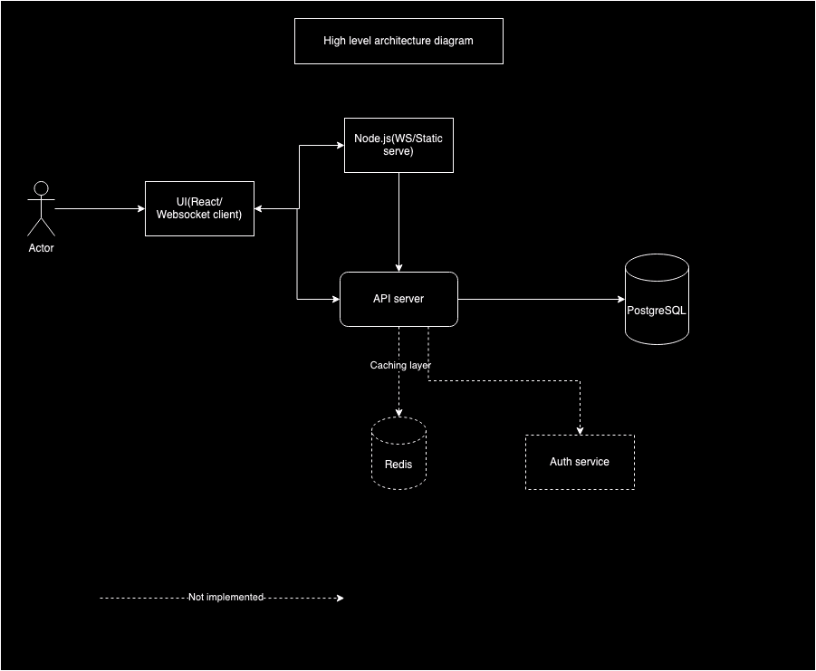

# Quiz System Architecture

## Overview

This document provides an overview of the architecture for our quiz system. It describes the various components involved, their interactions, and the data flow within the system.

1. **User Participation**:
   - Users should be able to join a quiz session using a unique quiz ID.
   - The system should support multiple users joining the same quiz session simultaneously.

2. **Real-Time Score Updates**:
   - As users submit answers, their scores should be updated in real-time.
   - The scoring system must be accurate and consistent.

3. **Real-Time Leaderboard**:
   - A leaderboard should display the current standings of all participants.
   - The leaderboard should update promptly as scores change.


## Architecture Diagram



## High Level Design Explanation

### Client Applications
- **Web App:** Interacts with the WebSocket Server for real-time communication and the API Server for RESTful requests.
- **Mobile App (iOS/Android):** Similar interactions as the Mobile App, providing a browser-based interface for users.

### Backend Services
- **WebSocket Server/Node.js server :** Manages real-time communication, interacts with clients and the Quiz Question Service, updates scores in the database, and broadcasts score updates. Also serves react UI
- **API Server:** Handles RESTful API requests, performs CRUD operations on the primary database, and manages quiz APIs, admin interfaces, user authentication through the Authentication Service (Not implemented).

### Database
- **Postgres Database (SQL):** Stores user data, quiz questions, scores, and leaderboard data.

### External Services (Not implemented)
- **Authentication Service (e.g., OAuth):** Manages user authentication and authorization.
- **Quiz Question Service:** Provides quiz questions, verifies answers, and ensures a continuous supply of fresh questions.

## Data Flow

### User Joins a Quiz
1. The client sends a request to the API server to join a quiz session.
2. The API server authenticates the user via the Authentication Service.
3. The WebSocket server establishes a real-time connection with the client.

### Real-Time Quiz Participation
1. Quiz questions are fetched from the Quiz Question Service.
2. Users submit answers through the client app, which sends the answers to the WebSocket server.
3. The WebSocket server validates answers using the Quiz Question API and updates the user’s score in the database.

### Real-Time Score Updates
1. As scores are updated in the database, the WebSocket server broadcasts the updated scores to all connected clients.
2. The client apps receive the score updates and refresh the leaderboard in real-time with help of wesocket.

## Tools and Technologies

- **Web Application Development:** React.js
- **Backend Development:** Node.js, Express.js
- **Real-Time Communication:** WebSockets, Socket.IO
- **Database:** PostgreSQL (SQL),
- **Cache:** Redis
- **Authentication:** OAuth 2.0, JWT (JSON Web Tokens)
- **API Development:** RESTful APIs, Django Admin
- **External Services:** Third-party quiz question APIs, OAuth providers (Google, Facebook, etc.)
- **Hosting and Deployment:** AWS, Azure, Google Cloud Platform (Proposal)
- **Mobile Application Development:** React Native


## Getting Started

To set up the project locally, Make sure Docker, Node.js(18) and Python(3.8) environment is ready, follow these steps:

1. **Clone the repository:**
    ```sh
    git clone https://github.com/tamilselvanbits/quiz_app.git
    cd quiz_app
    python -m venv venv
    source venv/bin/activate
    docker compose up -d
    ```
2. **Install dependencies:**
    ```sh
    cd client
    npm install
    cd..
    npm install
    pip install requirements.txt
    python manage.py migrate
    ```

3. **Configure environment variables:**
    Create a `.env` file in the root directory and add the necessary configuration settings. Refer .env.example

4. **Start the development server:**
    ```sh
    npm run start
    Create one superuser for admin and testing user id 1(hard coded) for saving scores
    python manage.py createsuperuser
    ```

5. **Open your browser:**
    ```
    UI: http://localhost:4000
    Admin: http://localhost:8003/admin
    ```

5. **TODO:**
    Node.js / Python best practices and logger needs to be added
    https://expressjs.com/en/advanced/best-practice-security.html
    Need to make smaller react components
    API url and ports need to be moved to env or config files
    I don't have much time to cover all these. please let me know it needs to be covered
